# Athena Intelligence: Multi-Agent Investment Analysis System

## 🎯 Overview

**Athena Intelligence** is a multi-agent system that autonomously analyzes Australian Securities Exchange (ASX) price-sensitive announcements and generates intelligent trading recommendations with human-in-the-loop approval. Built using Google's Agent Development Kit (ADK) and Gemini 2.5 Flash, this system demonstrates the power of coordinated AI agents working together to solve complex real-world financial analysis tasks.

**Hackathon**: [Agents Intensive Capstone Project](https://www.kaggle.com/competitions/agents-intensive-capstone-project/overview)
**Framework**: Google Agent Development Kit (ADK)
**LLM**: Gemini 2.5 Flash


---

## 💡 Problem Statement

Every day, the Australian Securities Exchange publishes announcements from hundreds of companies which includes price-sensitive announcements with critical updates. Investment analysts spend hours manually reading PDFs, cross-referencing market data, and tracking company promises to make a single investment decision:
- **Regulatory filings**: Price-sensitive announcements (PDFs) published on ASX
- **Market data**: Real-time stock prices and historical performance
- **Historical context**: Company track record and trend analysis
- **Quality assessment**: Evaluating reliability of management promises

Traditional approaches face challenges:
- Manual analysis is time-consuming and doesn't scale
- A Single-agent monolithic agent can suffer from context limitation and does not scale
- Identifying market reaction based on released announcement is a critical and time-sensitive activity. 
- It's cruicial to perform methodical analysis to identify market overreaction and take a investment decision. We want to automate the rigorous data collectiona and analysis activity but still require human oversight in final trading decisions

**Solution**: A coordinated multi-agent system where each agent specializes in one domain, communicating via Agent-to-Agent (A2A) protocol to deliver comprehensive investment recommendations and Human in the loop trading.

---

## 🏗️ Architecture

### Multi-Agent System Design

The system consists of **7 specialized A2A agents** orchestrated through a coordinator, with integrated observability and human-in-the-loop trading approval:

```
┌──────────────────────────────────────────────────────────────────────┐
│                    PHOENIX OBSERVABILITY LAYER                        │
│   📊 Real-time tracing of LLM calls, agent interactions, A2A protocol │
│         OpenTelemetry instrumentation via google-adk package          │
└──────────────────────────────────────────────────────────────────────┘
                                    ↓
┌──────────────────────────────────────────────────────────────────────┐
│           COORDINATOR AGENT (Port 8000) - ROOT AGENT                  │
│     • Orchestrates complete pipeline with user access                │
│     • Delegates to Trading Agent (A2A sub-agent with HTIL)           │
│     • All agents instrumented with Phoenix tracing                   │
└────┬─────────┬──────────┬──────────────┬──────────┬─────────────────┘
     │ A2A     │ A2A      │ A2A          │ A2A      │ A2A
     ▼         ▼          ▼              ▼          ▼
┌─────────┐ ┌──────┐  ┌───────┐    ┌─────────┐ ┌──────────┐
│ SCRAPER │ │ANALYZ│  │ STOCK │    │EVALUATOR│ │ TRADING  │
│  8001   │ │  ER  │  │ 8003  │    │  8005   │ │  8006    │
│         │ │ 8002 │  │       │    │         │ │  (HTIL)  │
│Playwright│ │Gemini│  │yfinance│   │LLM-Judge│ │LongRun.. │
│         │ │ PDF  │  │       │    │         │ │FuncTool  │
└─────────┘ └──────┘  └───────┘    └─────────┘ └──────────┘
   │           │          │              │          │
   │           │          │              │          │
   ▼           ▼          ▼              ▼          ▼
┌──────────────────────────────────────────────────────────┐
│              SQLite Database (WAL Mode)                   │
│  Companies, Announcements, Analysis, Stock Data,          │
│  Evaluations, Trading Decisions (11 tables)               │
└──────────────────────────────────────────────────────────┘

NOTE: Memory Agent (8004) is currently DISABLED for future roadmap
NOTE: Trading Agent uses LongRunningFunctionTool for Human-in-the-Loop
      (Based on Google's official A2A HTIL example pattern)
```

### Agent Specializations

#### 1. **Coordinator Agent** (Gemini 2.5 Flash)
- **Role**: Pipeline orchestrator
- **Key Innovation**: JSON-RPC 2.0 message/send + polling pattern for A2A communication
- **Capabilities**:
  - Manages workflow: Scraper → Analyzer → Stock → Evaluation → Trading
  - Parallel task execution (Analyzer + Stock agents run concurrently)
  - Error handling and retry logic
  - Progress logging

#### 2. **Scraper Agent** (Playwright-based)
- **Role**: ASX announcement acquisition
- **Capabilities**:
  - Uses Playwright for scraping
  - Scrapes company-specific ASX pages
  - Filters price-sensitive announcements
  - Deduplication against database and avoid reprocessing already processed announcements
  - Extracts structured metadata (title, date, PDF URL)
  - Downloads PDFs from ASX URLs

#### 3. **Analyzer Agent** (Gemini 2.5 Flash, temp=0.3)
- **Role**: PDF processing and AI-powered analysis
- **Key Innovation**: 🌟 **Gemini File API for Native PDF Parsing**
- **Why This Matters**:
  - **Native multimodal understanding**: Gemini directly reads PDF layouts, tables, and charts
  - **Superior accuracy**: Eliminates text extraction errors from PyMuPDF conversion
  - **Simplified pipeline**: No intermediate markdown conversion needed
  - **Better analysis outcome**: Can understand tables and complex layouts and generate useful insights.
- **Capabilities**:
  - Uploads to Gemini File API for processing
  - Generates structured analysis:
    - Executive summary
    - Sentiment (BULLISH/BEARISH/NEUTRAL)
    - Key insights (5-7 bullet points)
    - Management promises (trackable commitments)
    - Financial impact assessment
  - Automatic file cleanup after analysis
  - Retry logic (3 attempts with exponential backoff)
  - Database caching to avoid reprocessing

#### 4. **Stock Agent** (yfinance integration)
- **Role**: Real-time market data acquisition
- **Capabilities**:
  - Current price and market capitalization
  - Historical performance (1M/3M/6M returns)
  - ASX ticker handling (.AX suffix)
  - TTL caching (1-hour refresh)
  - Graceful handling of missing data

#### 5. **Evaluation Agent** (LLM-as-a-Judge pattern)
- **Role**: Quality assessment + Investment recommendations
- **Key Innovation**: Dual-purpose scoring system
- **Capabilities**:
  - **Quality Scoring** (1-5 scale):
    - Summary completeness
    - Sentiment accuracy
    - Insights depth
    - Overall analysis quality
  - **Investment Recommendations**:
    - Recommendation types: BUY, HOLD, SELL, SPECULATIVE BUY, AVOID
    - Historical context analysis (last N announcements)
    - Trend detection (improving vs. deteriorating)
    - Promise tracking (commitments vs. delivery)
    - Confidence scoring (0-1)
    - Detailed reasoning

#### 6. **Trading Agent** (Port 8006 - A2A with HTIL)
- **Role**: Paper trading with human-in-the-loop approval
- **Key Innovation**: 🌟 **LongRunningFunctionTool Pattern for A2A Human-in-the-Loop**
- **Why This Approach**:
  - **True A2A architecture**: All 7 agents are remote services (scalable, fault-isolated)
  - **Clean separation**: Coordinator (root agent) has user access, Trading handles execution
- **Capabilities**:
  - Creates trading recommendations based on evaluation
  - Pauses execution pending human approval
  - Tracks approvals via database `ticket_id`
  - Executes paper trades (no real money)
  - Full audit trail of trading decisions
  - Resumable across coordinator restarts

---

## 🔄 Pipeline Flow

### Example: "Analyze BHP's last 5 announcements"

```mermaid
sequenceDiagram
    participant User
    participant Coordinator
    participant Phoenix
    participant Scraper
    participant Analyzer
    participant Stock
    participant Evaluator
    participant Trading

    Note over Phoenix: 📊 All interactions traced via OpenTelemetry

    User->>Coordinator: Analyze BHP (limit=5)
    Coordinator->>Phoenix: Trace: User request received
    Coordinator->>Scraper: A2A: Fetch announcements
    Scraper-->>Coordinator: 3 new announcements
    Coordinator->>Phoenix: Trace: Scraper completed

    loop For each announcement
        par Parallel Processing
            Coordinator->>Analyzer: A2A: Upload PDF to Gemini API
            Note over Analyzer: 🌟 Native PDF parsing via File API
            Analyzer->>Phoenix: Trace: LLM call (gemini-2.5-flash)
            Coordinator->>Stock: A2A: Fetch market data
            Stock->>Phoenix: Trace: yfinance API call
        end

        Analyzer-->>Coordinator: Analysis complete
        Stock-->>Coordinator: Price data ready
        Coordinator->>Phoenix: Trace: Parallel processing done

        Coordinator->>Evaluator: A2A: Generate recommendation
        Evaluator->>Phoenix: Trace: LLM-as-Judge evaluation
        Evaluator-->>Coordinator: BUY signal

        alt BUY or SPECULATIVE BUY
            Coordinator->>Trading: A2A: Execute trade (HTIL)
            Note over Trading: 🌟 LongRunningFunctionTool pauses
            Trading-->>Coordinator: {status: pending, ticket_id: xxx}
            Coordinator->>User: Confirm trade? (ticket: xxx)
            User->>Coordinator: Approved
            Coordinator->>Trading: A2A: Send approval (ticket: xxx)
            Note over Trading: Resume execution
            Trading->>Phoenix: Trace: Paper trade executed
            Trading-->>Coordinator: Trade confirmed
        else HOLD/SELL/AVOID
            Coordinator-->>User: No action needed
        end

        Coordinator->>Phoenix: Trace: Announcement processing complete
    end

    Coordinator-->>User: Final recommendation
    Coordinator->>Phoenix: Trace: Pipeline complete
```



### Key Features

1. **Parallel Execution**: Analyzer and Stock agents run concurrently (40% faster)
2. **Deduplication**: Checks database before processing (avoids redundant work)
3. **Error Resilience**: Each agent has independent retry logic
4. **Human in the loop**: Trading requires explicit human approval (safety mechanism)

---

## 📊 Capabilities Demonstrated

### 1. **Multi-Agent Coordination**
- ✅ Independent services communicating via A2A protocol
- ✅ JSON-RPC 2.0 message passing
- ✅ Task polling for async results
- ✅ Error propagation and handling

### 2. **Production-Grade Engineering**
- ✅ Structured logging (Loguru)
- ✅ Type safety (Pydantic schemas)
- ✅ Configuration management (.env + Pydantic Settings)
- ✅ Retry logic with exponential backoff
- ✅ Graceful degradation (missing data handling)

### 3. **LLM Orchestration**
- ✅ Temperature control (0.3 for factual analysis)
- ✅ Token management (content truncation)
- ✅ Prompt engineering (structured JSON outputs)
- ✅ Fallback strategies (retry on errors)

### 4. **Real-World Integration**
- ✅ Browser automation (Playwright)
- ✅ google-genai multimodal pdf processing + naive PDF processing (PyMuPDF)
- ✅ Financial APIs (yfinance)
- ✅ Database persistence (SQLite)
- ✅ HTTP clients (httpx for A2A + downloads)

### 5. **Human-in-the-Loop**
- ✅ ADK resumable apps
- ✅ Approval workflows
- ✅ Session persistence
- ✅ Audit trails (trading decisions table)

---

## 🎯 Results & Performance

### Sample Output: BHP Analysis

**Input**: `Analyze BHP, limit=5, price_sensitive_only=True`

**Output**:
```json
{
  "announcements_processed": 3,
  "analyses": [
    {
      "title": "BHP - FY24 Results",
      "sentiment": "BULLISH",
      "summary": "Strong earnings beat with 12% YoY revenue growth...",
      "key_insights": [
        "Copper production increased 8% ahead of guidance",
        "Cost reduction program delivered $500M savings",
        "Dividend increased 15% to $1.50/share"
      ],
      "management_promises": [
        "Net-zero emissions by 2050",
        "CAPEX guidance $8-9B for FY25"
      ]
    }
  ],
  "evaluations": [
    {
      "recommendation": "BUY",
      "confidence_score": 0.85,
      "reasoning": "Strong operational performance with consistent delivery on promises. Copper exposure benefits from energy transition tailwinds. Valuation attractive at 12x PE vs. sector average 14x."
    }
  ],
  "trading_signals": [
    {
      "status": "PENDING_APPROVAL",
      "price_at_decision": 45.23,
      "trade_amount": 10000,
      "quantity": 221
    }
  ]
}
```

---

## 🛠️ Technical Stack

### Core Frameworks
- **ADK (Agent Development Kit)**: Google's official agent framework
- **Gemini 2.5 Flash**: Primary LLM (temperature=0.3, max_tokens=2048)
- **google-genai**: 🌟 New Google GenAI SDK for File API (native PDF parsing)
- **SQLAlchemy**: ORM with SQLite backend (WAL mode)
- **Pydantic**: Schema validation and settings

### Key Libraries
- **Playwright**: Browser automation (ASX scraping)
- **google-genai (File API)**: 🌟 Direct PDF upload to Gemini
- **yfinance**: Stock market data (ASX tickers)
- **httpx**: Async HTTP client (A2A + downloads)
- **Starlette/Uvicorn**: ASGI server for A2A endpoints
- **Loguru**: Structured logging

### Observability
- **Arize Phoenix**: 🌟 LLM observability platform
- **OpenTelemetry**: Distributed tracing protocol
- **openinference-instrumentation-google-adk**: 🌟 Auto-instrumentation for ADK agents

### Development Tools
- **pytest**: Testing framework
- **python-dotenv**: Environment management
- **Streamlit**: Web UI for chat interface and approvals

---

## 🚀 How to Run

### Prerequisites
```bash
# Python 3.11+
# Gemini API key (https://ai.google.dev/)
# Docker (for Phoenix observability)
```

**Required Software**:
- **Python 3.11+**: For running agents and scripts
- **Gemini API Key**: Get one at https://ai.google.dev/
- **Docker**: For Phoenix observability dashboard (optional, can be disabled with `PHOENIX_ENABLED=false`)

### Setup
```bash
# Clone repository
git clone https://github.com/tanveeruddin/asx_adk_gemini.git
cd asx_adk_gemini

# Install dependencies
pip install -r requirements.txt

# Configure environment
cp .env.example .env
# Add your GEMINI_API_KEY to .env

# Initialize database
python scripts/init_db.py --reset --seed --verify
```

### Start Phoenix Observability (Required Before Agents)

**IMPORTANT**: Phoenix Docker container must be running before starting any agents, otherwise agents will hang on startup trying to connect to the Phoenix server.

```bash
# Start Phoenix observability server with Docker
docker compose up

# This will:
# - Start Phoenix UI on http://localhost:6006 (web dashboard)
# - Listen for OpenTelemetry traces on port 4317
# - Display real-time agent traces, LLM calls, and A2A protocol communication

# Keep this terminal running while agents are active
```

**Verification**:
- Open http://localhost:6006 in your browser
- You should see the Phoenix dashboard
- Leave this running in the background

**Optional**: Disable Phoenix if you don't need observability:
```bash
# In your .env file, set:
PHOENIX_ENABLED=false

# Then you can skip the Docker step
```

### Start Agents
```bash
# Option A: All agents at once (recommended)
python main.py --all

# This starts:
# - All 7 A2A agents (ports 8000-8006)
# - Phoenix observability dashboard (http://localhost:6006)
# - Approval service UI (http://localhost:8888)

# Option B: Individual agents (7 terminals)
python -m agents.coordinator.main  # Port 8000 (ROOT AGENT)
python -m agents.scraper.main      # Port 8001
python -m agents.analyzer.main     # Port 8002 (Gemini PDF API)
python -m agents.stock.main        # Port 8003
python -m agents.evaluation.main   # Port 8005
python -m agents.trading.main      # Port 8006 (HTIL with LongRunningFunctionTool)

# Streamlit Chat UI (optional)
streamlit run chat_ui.py           # Port 8501

# Approval Service (for web-based approvals)
python approval_service.py         # Port 8888
```

### Run Pipeline
```bash
# Analyze BHP's last 5 announcements
python scripts/trigger_pipeline.py \
    --asx-code BHP \
    --limit 5 \
    --price-sensitive

# Expected output:
# 🚀 Starting pipeline for BHP...
# 📋 Processing announcement: BHP - FY24 Results
# 📄 Calling analyzer agent...
# 📈 Calling stock agent...
# ✅ Analyzer and stock agents completed
# 📊 Calling evaluation agent...
# 💰 Evaluation complete: BUY
# 🚨 BUY signal detected! Calling trading agent...
# ⏳ Waiting for human approval...
# ✅ Trading decision: PENDING_APPROVAL
```

---

## 🧪 Testing

### Unit Tests
```bash
# Test individual agents
python scripts/test_scraper_agent.py
python scripts/test_analyzer_agent.py
python scripts/test_stock_agent.py
python scripts/test_evaluation_agent.py
python scripts/test_trading_agent.py
```

### End-to-End Test
```bash
# Full pipeline test
python scripts/test_pipeline_e2e.py --asx-code BHP --limit 3
```

---

## 📈 Future Enhancements

### Immediate Roadmap
1. **Memory Agent Re-enablement**: Episodic and semantic memory for long-term trend analysis
2. **Web UI**: Replace steamlit app (chat + approval) with future proof web app
3. **Batch Processing**: process last 2 years of historical data for key interest companies
4. **Performance Monitoring**: Real-time metrics and alerting
5. **BigQuery Integration**: Replace sqlLite with BigQuery
6. **Cloud Deployment**: Deploy in Cloud (Agent Engine/Cloud Run)

### Long-term Vision
1. **Real Trading Integration**: Connect to broker APIs (Interactive Brokers, etc.)
2. **Portfolio Management**: Track holdings, P&L, risk metrics
3. **Historical Backtesting**: Test strategies against past data. Bechmark paper trade with real world performance.
4. **Multi-Market Support**: Expand beyond ASX (NYSE, NASDAQ, LSE)

---

## 🙏 Acknowledgments

- Google's ADK team for the excellent framework
- Kaggle for hosting this intensive program and capstone project
- ASX for providing public access to announcements
- The open-source community (Playwright, PyMuPDF, yfinance authors)

